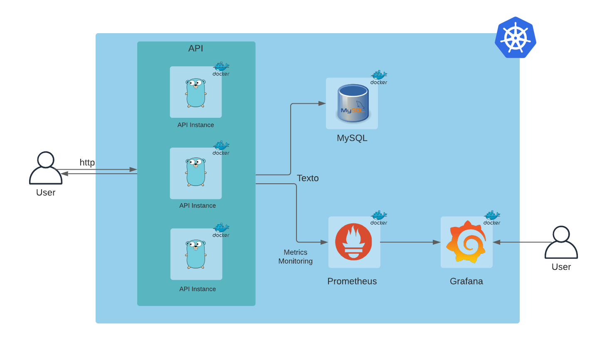

# Cartesian

[](https://github.com/leozz37/cartesian/actions/workflows/build.yml)
[](https://github.com/leozz37/cartesian/actions/workflows/unit_tests.yml)
[](https://github.com/leozz37/cartesian/actions/workflows/functional_tests.yml)
[](https://github.com/leozz37/cartesian/actions/workflows/docker.yml)
[](https://github.com/leozz37/cartesian/actions/workflows/docker_compose.yml)
[](https://github.com/leozz37/cartesian/actions/workflows/terraform.yml)

This is an API for Civi test.

## Contents

- [Architecture](#architecture)
  - [Directory Structure](#directory-structure)
- [Quick-start](#quick-start)
- [Dependencies](#dependencies)
- [Building](#building)
  - [Binary](#binary)
  - [Makefile](#makefile)
  - [Docker](#docker)
  - [Docker-compose](#docker-compose)
  - [Kubernetes](#kubernetes)
- [Testing](#testing)
  - [Unit Tests](#unit-tests)
  - [Functional Tests](#functional-tests)
- [Endpoints](#endpoints)
  - [/points](#points)
  - [/api/points](#api-points)

### Architecture

This is the actual state of the project architecture.



### Directory Structure

The project is divided by the following strucure:

```txt
.github
    |__ workflows
controllers
data
handler
k8s
models
resources
routes
services
    |__ db
    |__ metrics
terraform
tests
```

These following directory has some misc files, not directly related to the API code:

- [.github/](./github) holds the GitHub templates.

- [.github/worflows](.github/worflows) has the CI pipelines for GitHub Actions.

- [k8s](./k8s) Kubernetes services and pods config files.

- [data](./data) has configuration files for some services.

- [resources](./resources) has configuration files for some services and misc files.

- [terraform](./terraform) has Terraform infra as code files.

- [tests](./tests) has the functional tests written in Robot Framework.

For the API, this is the direcoty rules:

- [handler](./handler) has the endpoint handlers.

- [controllers](./controllers) has the API tools.

- [models](./models) has the most used models across the API.

- [routes](./routes) has the Gin definitions of the endpoints routes.

- [services](./services) holds the services used across the code like the database.

- [services/db](./services/db) holds the databases integrations (MySQL and Redis).

- [services/metrics](./services/metrics) holds the metrics integrations (Prometheus).

## Quick-start

This is an REST API, made with [Golang](https://golang.org/) and [Gin](https://github.com/gin-gonic/gin). You can manually run it or use [docker-compose](https://docs.docker.com/compose/install/) (recommended) or [Kubernetes](https://kubernetes.io/docs/setup/) to get everthing up.

The majoraty of the sensible data is hardcoded on environment variables. Is not a good practice
but for the sake of simplicity, we'll be declaring them on the `.env.example` file. Change it if
needed for your environment.

## Dependencies

In this project we need the following dependencies:

- MySQL
- Prometheus
- Grafana
- Robot Framework

You can install them on your system or run them on containers (besides robot framework). If you're running them manually, set them up on the `.env.example` file to point to the right address or set the environment variables.

To install the API dependencies run:

```shell
$ go mod download
```

## Building

By far, the easiest way to get everything running is with `docker-compose`. See the [docker-compose](#docker-compose) section.

### Binary

To build the binary, run the following:

```shell
$ go build -o cartesian
```

To run the binary, run the following:

```shell
$ ./cartesian
```

Or simply:

```shell
$ go run main.go
```

### Makefile

To run the through the Makefile, run the following:

```shell
$ make run
```

### Docker

Make sure you have [Docker](https://www.docker.com/get-started) installed on your machine.

To build the Docker image, run the following:

```shell
$ docker build . -t cartesian
```

To run the Docker image, set the `$PORT` variable and run:

```shell
$ export PORT=8080

$ docker run --env "PORT=$PORT" -p $PORT:$PORT cartesian
```

### Docker-compose

To run the docker-compose, set the `$PORT` variable and run:

```shell
$ export PORT=8080

$ docker-compose up
```

### Kubernetes

To create the Kubernetes pods, make sure you have [MinuKube](https://minikube.sigs.k8s.io/docs/start/) or [Kind](https://kind.sigs.k8s.io/) installed. In this example, we'll be using `kind`.

Then run the following command:

Create a cluster:

```shell
$ kind create cluster --name=cartesian
```

Select the cluster you just created:

```shell
$ kubectl cluster-info --context kind-cartesian
```

Create the application pods:

```shell
$ kubectl apply -f k8s/
```

Verify pods status:

```shell
$ kubectl get pods
```

Wait until all the pods STATUS are `running`.

You can expose the API service port, running:

```shell
$ kubectl port-forward service/cartesian 8080:8080
```

## Testing

The unit testes are written with the default testing tool of Golang.

### Unit Tests

To run the unit tests, do the following:

```shell
$ go test -v ./...
```

To run the tests with coverage, do the following:

```shell
$ go test -v -covermode=count ./...
````

### Functional Tests

To run the functional tests, you need [Robot Framework](https://robotframework.org/) and its dependencies. To install everythin, run the following:

```shell
$ pip install robotframework robotframework-requests robotframework-jsonlibrary
```

Make sure the system is running, as we suggested with `docker-compose`. And run the following:

```shell
$ docker-compose up -d

$ robot -d output/ tests/
```

## Endpoints

For testing, you should use [wget](https://www.gnu.org/software/wget/), [cURL](https://curl.se/) or [Postman](https://www.postman.com/). Right now all the API requests are made over HTTP.

### Points

Returns all points from the JSON file, that are stored on the Database.
#### URL

`/points`

#### METHODS

`GET`

#### RESPONSES

- 200: `Success Response`

Return list of all points.

```json
{
    "code": 200,
    "message": [
        {
            "x": 63,
            "y": -72
        },
        {
            "x": -94,
            "y": 89
        },

        ...

        {
            "x": -30,
            "y": -38
        }
    ]
}
```

- 400: `Bad Request`

Error fetching the data from Database.

```json
{
  "code": 400,
  "message": "couldn't fetch data from database"
}

```

#### Example

Example using cURL:

```shell
$ curl -X GET http://localhost:8080/points                                 

{"message":[{"x":63,"y":-72},{"x":-94,"y":89},{"x":-30,"y":-38},{"x":-43,"y":-65},{"x":88,"y":-74},{"x":73,"y":89},{"x":39,"y":-78},{"x":51,"y":8},{"x":-92,"y":-93},{"x":-77,"y":-45},{"x":-41,"y":29},{"x":54,"y":-94},{"x":43,"y":-50},{"x":83,"y":66},{"x":79,"y":39},{"x":7,"y":-44},{"x":14,"y":50},{"x":-29,"y":-99},{"x":94,"y":-60},{"x":78,"y":8},{"x":-13,"y":-29},{"x":-61,"y":-45},{"x":95,"y":-14},{"x":-74,"y":-77},{"x":-3,"y":-76},{"x":-9,"y":-12},{"x":54,"y":-33},{"x":-89,"y":86},{"x":17,"y":37},{"x":-69,"y":-4},{"x":-80,"y":41},{"x":-25,"y":60},{"x":58,"y":-8},{"x":47,"y":-51},{"x":80,"y":-83},{"x":-89,"y":69},{"x":-42,"y":97},{"x":-26,"y":-80},{"x":-41,"y":-75},{"x":-3,"y":-29},{"x":16,"y":62},{"x":-7,"y":-59},{"x":-6,"y":-10},{"x":-47,"y":71},{"x":-32,"y":79},{"x":74,"y":65},{"x":-82,"y":55},{"x":62,"y":-57},{"x":36,"y":86},{"x":-38,"y":-59},{"x":18,"y":-3},{"x":-31,"y":63},{"x":76,"y":42},{"x":-44,"y":75},{"x":-17,"y":96},{"x":98,"y":-86},{"x":-42,"y":-92},{"x":-20,"y":2},{"x":-32,"y":-84},{"x":-46,"y":45},{"x":83,"y":-20},{"x":-46,"y":67},{"x":27,"y":1},{"x":64,"y":17},{"x":-64,"y":-33},{"x":-65,"y":-37},{"x":90,"y":43},{"x":37,"y":-33},{"x":91,"y":49},{"x":9,"y":49},{"x":2,"y":-8},{"x":-44,"y":-65},{"x":30,"y":26},{"x":-77,"y":93},{"x":-88,"y":-72},{"x":-61,"y":60},{"x":-60,"y":74},{"x":8,"y":52},{"x":-84,"y":-2},{"x":-3,"y":52},{"x":19,"y":35},{"x":-36,"y":41},{"x":-98,"y":74},{"x":84,"y":-71},{"x":74,"y":37},{"x":92,"y":-32},{"x":96,"y":64},{"x":-13,"y":-72},{"x":-25,"y":11},{"x":-60,"y":16},{"x":-100,"y":84},{"x":84,"y":-33},{"x":28,"y":95},{"x":-55,"y":29},{"x":-73,"y":60},{"x":-24,"y":63},{"x":29,"y":55},{"x":-50,"y":-61},{"x":-5,"y":95},{"x":-59,"y":38}]}
```

### Api Points

Return the all the points within the give `distance` from the point `X` and `Y`.

#### URL

`/api/points?:distance&:x&:y`

#### URL PARAMS

**Required**:

`distance=[float]`

`x=[float]`

`y=[float]`

#### RESPONSE

- 200: `Success Response`

Returns a list of the matching coordinates.

```json
{
    "code": 200,
    "message": [
        {
            "x": 63,
            "y": -72
        }
    ]
}
```

- 400: `Bad request`

Bad parameter data

```json
{
    "Code": 400,
    "Message": "bad parameter data"
}
```

#### EXAMPLE

```shell
$ curl -X GET "http://localhost:8080/api/points?x=-94&y=89&distance=318"

{"message":[{"x":63,"y":-72}]}
```
